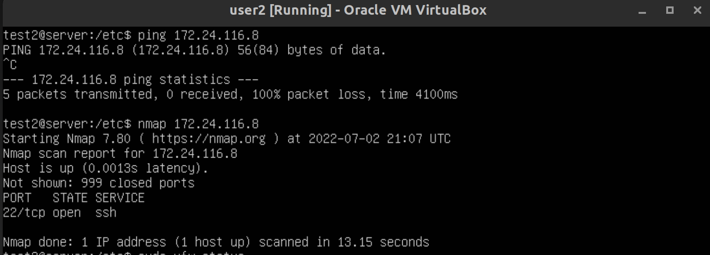
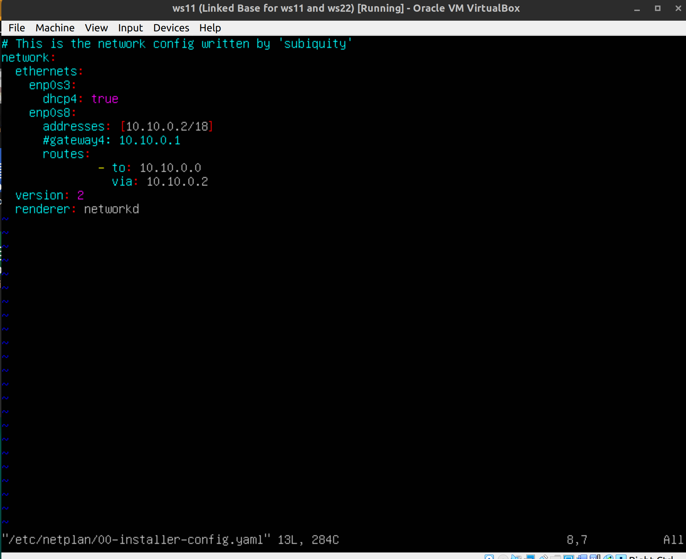
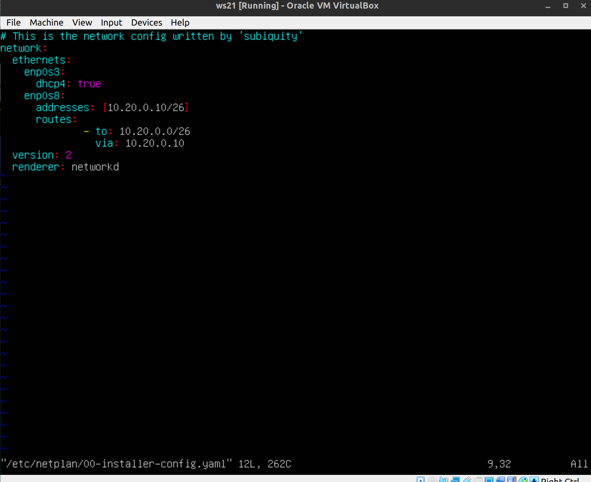
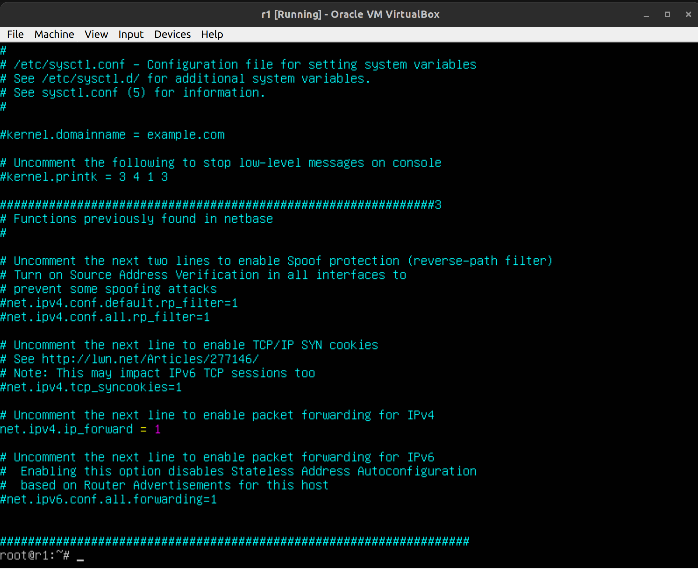
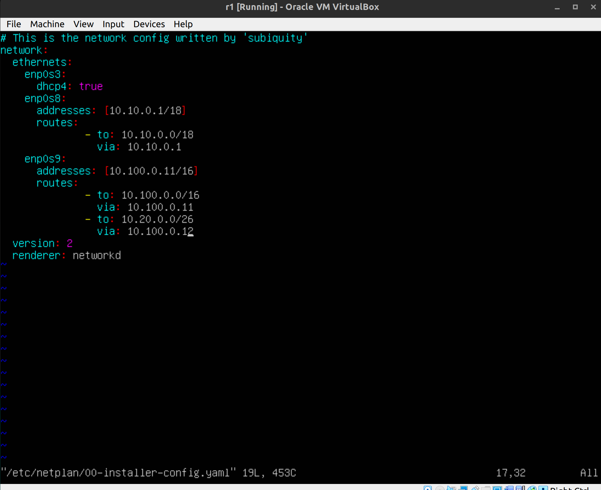
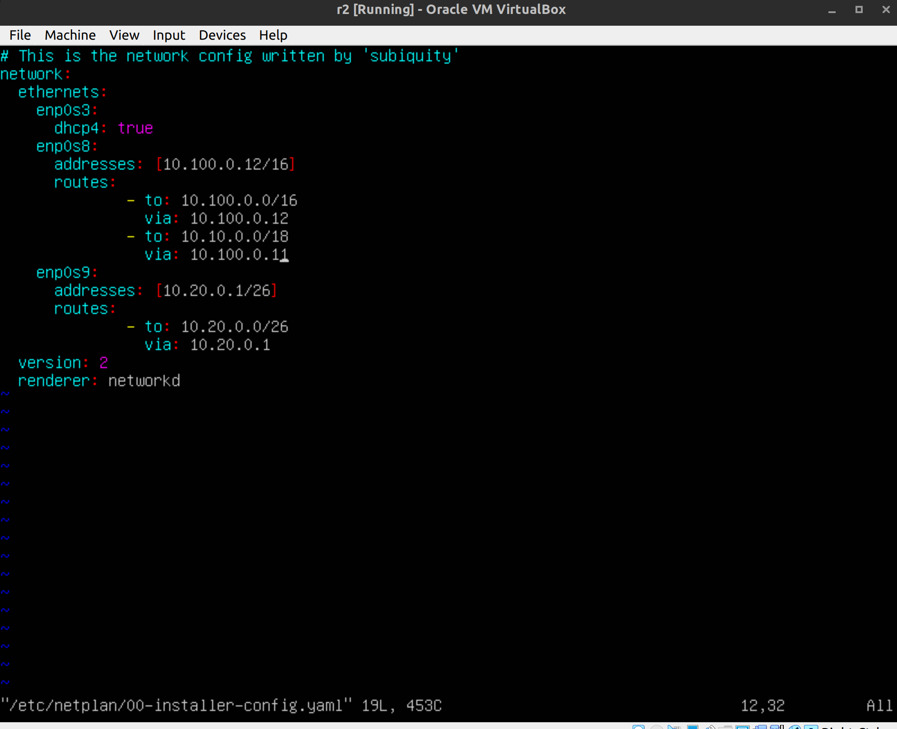
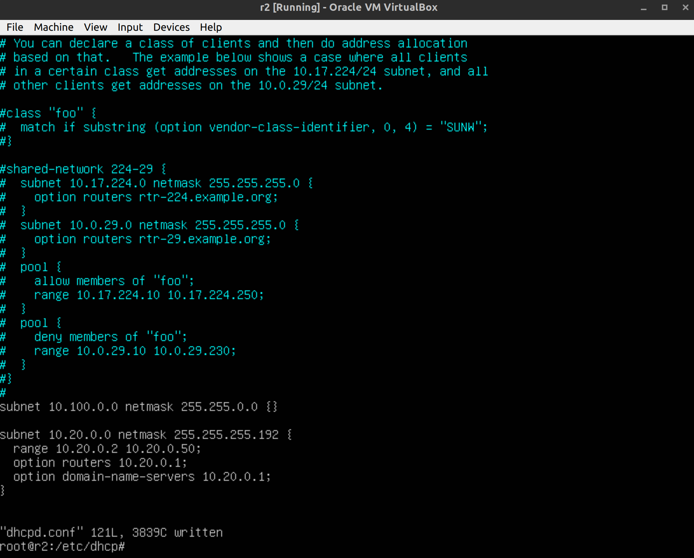
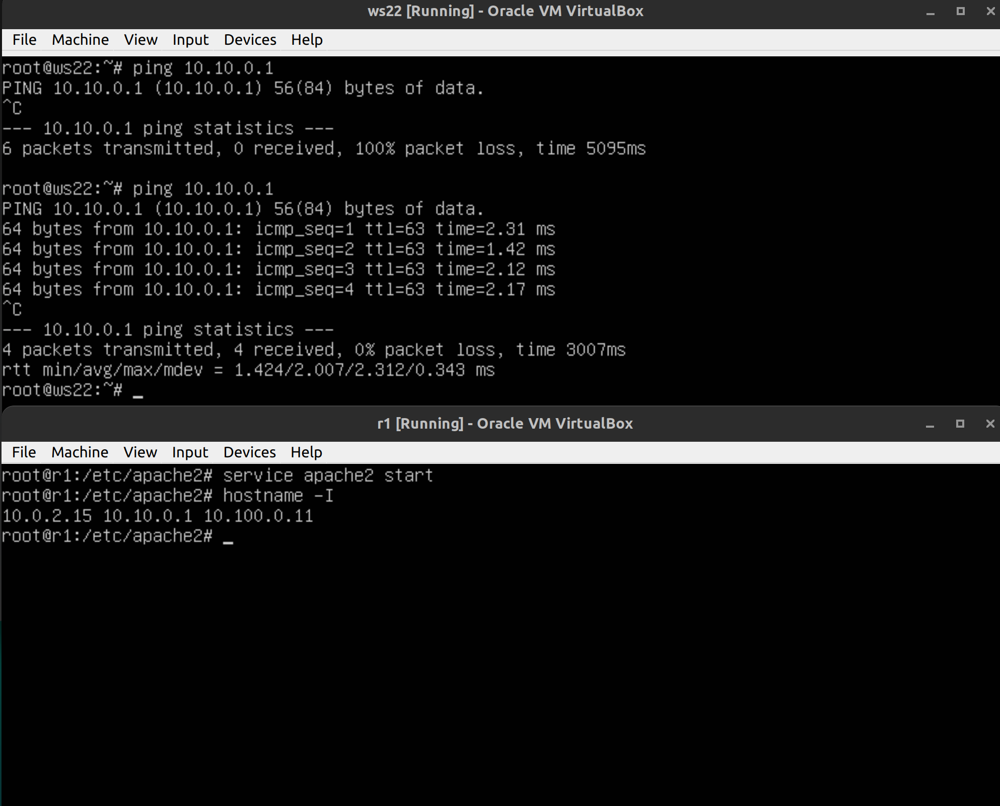

## Part 1. Инструмент ipcalc

### Адрес сети 192.167.38.54/13

<b>Адрес сети - 192.160.0.0</b>

### Перевод масок

<b>Префиксная запись - /24, двоичная - 11111111.11111111.11111111.00000000</b>


<b>Обычная запись - 255.254.0.0, двоичная - 11111111.11111110.00000000.00000000</b>


<b>Обычная запись - 255.255.255.240, префиксная - /28</b>

### Минимальный / максимальный хост в сети 12.167.38.4
- с маской /8

<b>HostMin - 12.0.0.1, HostMax - 12.255.255.254</b>

- с маской 11111111.11111111.00000000.00000000

<b>HostMin - 12.167.0.1, HostMax - 12.167.255.254</b>

- с маской 255.255.254.0

<b>HostMin - 12.167.38.1, HostMax - 12.167.39.254</b>

- с маской /4

<b>HostMin - 0.0.0.1, HostMax - 15.255.255.254</b>

### Localhost
Диапазон localhost: 127.0.0.1 — 127.255.255.254

- 194.34.23.100 - не localhost
- 127.0.0.2 - localhost
- 127.1.0.1 - localhost
- 128.0.0.1 - не localhost


### Диапазоны и сегменты сетей

Диапазоны выделенные локальным сетям:
- 10.0.0.0 — 10.255.255.255
- 100.64.0.0 — 100.127.255.255
- 172.16.0.0 — 172.31.255.255
- 192.168.0.0 — 192.168.255.255

- 10.0.0.45 - частный
- 134.43.0.2 - публичный
- 192.168.4.2 - частный 
- 172.20.250.4 - частный
- 172.0.2.1 - публичный
- 192.172.0.1 - публичный
- 172.68.0.2 - публичный
- 172.16.255.255 - частный
- 10.10.10.10 - частный
- 192.169.168.1 - публичный

IP адреса шлюза у сети 10.10.0.0/18:


<b>10.10.0.0/18</b>

- 10.0.0.1 - неверный
- 10.10.0.2 - верный
- 10.10.10.10 - верный
- 10.10.100.1 - неверный
- 10.10.1.255 - верный

## Part 2. Статическая маршрутизация между двумя машинами


<b>Вывод команды ip a, одинаковый на обеих машинах</b>

Задать следующие адреса и маски: 
- ws1 - 192.168.100.10/16
- ws2 - 172.24.116.8/12


<b>Задать статический IP адрес на машине 1</b>


<b>Задать статический IP адрес на машине 2</b>

### Добавление статического маршрута вручную


<b>Задать статический IP адрес на машине 1</b>


<b>Задать статический IP адрес на машине 2</b>

### Добавление статического маршрута с сохранением


<b>Добавить статический маршрут от одной машины до другой с помощью файла etc/netplan/00-installer-config.yaml</b>


<b>Добавить статический маршрут от одной машины до другой с помощью файла etc/netplan/00-installer-config.yaml</b>


<b>Пинг машины 1</b>


<b>Пинг машины 2</b>

## Part 3. Утилита iperf3

- 8 Mbps = 1 MB/s (мегабиты в мегабайты)
- 100 MB/s = 819200 Kbps (мегабайты в килобиты)
- 1 Gbps = 1024 Mbps (гигабиты в мегабиты)

**Скорость соединения между ws1 и ws2**


<b>Запуск iperf на сервере</b>


<b>Запуск iperf на клиенте</b>

## Part 4. Сетевой экран


<b>Порядок прохождения пакетов через брандмауэр</b>

[Документация по iptables](https://www.opennet.ru/docs/RUS/iptables/)


<b>/etc/firewall машина 1</b>


<b>/etc/firewall машина 2</b>

После того как сработали запрещающие правила, они не заменяются разрешающими

**Запуск скриптов**

```
chmod +x /etc/firewall.sh
```

<b>iptables -L</b>


<b>iptables -L</b>

### Утилита nmap


<b>вывод команды nmap</b>

## Part 5. Статическая маршрутизация сети

### 5.1. Настройка адресов машин

Конфигурации машин:







Пропинговать ws22 с ws21, пропинговать r1 с ws11


### 5.2. Включение переадресации IP-адресов

Изменить файл /etc/sysctl.conf на обоих роутерах
```
net.ipv4.ip_forward = 1
sysctl -p /etc/sysctl.conf 
```




### 5.3. Установка маршрута по-умолчанию

Настроить маршрут по-умолчанию (шлюз) для рабочих станций. Для этого добавить gateway4 [ip роутера] в файле конфигураций


Вызвать ip r и показать, что добавился маршрут в таблицу маршрутизации


Пропинговать с ws11 роутер r2 и показать на r2, что пинг доходит


### 5.4. Добавление статических маршрутов

Добавить в роутеры r1 и r2 статические маршруты в файле конфигураций





Вызвать ip r и показать таблицы с маршрутами на обоих роутерах


##### Запустить команды на ws11:
`ip r list 10.10.0.0/[маска сети]` и `ip r list 0.0.0.0/0`


<b>комент по поводу дефолтной сети</b>

### 5.5. Построение списка маршрутизаторов

При помощи утилиты traceroute построить список маршрутизаторов на пути от ws11 до ws21


traceroute передвигается по маршрутам по умолчанию, отправляет по 3 пакета, засекает время

### 5.6. Использование протокола ICMP при маршрутизации

Запустить на r1 перехват сетевого трафика, проходящего через eth0 с помощью команды: tcpdump -n -i eth0 icmp

Пропинговать с ws11 несуществующий IP (например, 10.30.0.111) с помощью команды: ping -c 1 10.30.0.111


## Part 6. Динамическая настройка IP с помощью DHCP


Для r2 настроить в файле /etc/dhcp/dhcpd.conf конфигурацию службы DHCP. Указать адрес маршрутизатора по-умолчанию, DNS-сервер и адрес внутренней сети.

```
apt install isc-dhcp-server
vim /etc/dhcp/dhcpd.conf
```



В файле resolv.conf прописать nameserver 8.8.8.8.


<b>настройка не имеет смысла</b>

`systemctl restart isc-dhcp-server`


<b>меняем настройки получения ip-адреса на машине ws21 на динамические</b>


<b>видим что адрес на интерфейсе enp0s8 находится в диапазоне заданном на маршрутизаторе</b>


<b>на машине ws22 адрес задается по прежнему статически, при этом машина пингуется с ws21 и наоборот</b>

**Указать MAC адрес у ws11, для этого в etc/netplan/00-installer-config.yaml надо добавить строки: macaddress: 10:10:10:10:10:BA, dhcp4: true**


**Для r1 настроить аналогично r2, но сделать выдачу адресов с жесткой привязкой к MAC-адресу (ws11)**


[Статья про конфигурацию dhcp](https://www.opennet.ru/base/net/dhcp_setup.txt.html)

#### ПОСЛЕ ТОГО КАК РУКАМИ ПОМЕНЯЛИ МАК АДРЕС В КОНФИГАХ НАДО ЕГО ПРОПИСАТЬ В НАСТРОЙКАХ ВИРТУАЛЬНОЙ МАШИНЫ, ИНАЧЕ ОНА НЕ ЗАГРУЗИТСЯ❤

Тесты на видимость в локальной сети работают, но доступ в интернет роутеры не выдают. Если переписать приоритет дефолтных шлюзов, можно поднять адаптер nat, но тогда пропадет локальная сеть. Вообще DNS сервер в файле resolv.conf не имеет смысла, тк файл переписывается каждый раз когда происходит рестарт dhcp.

Чекнуть [видос](https://www.youtube.com/watch?v=HDpCo7DvsgY)

**Запросить с ws21 обновление ip адреса**


## Part 7. NAT

В файле /etc/apache2/ports.conf на ws22 и r1 изменить строку Listen 80 на Listen 0.0.0.0:80, то есть сделать сервер Apache2 общедоступным

`apt install apache2`


Запустить веб-сервер Apache командой service apache2 start на ws22 и r1

Добавить в фаервол, созданный по аналогии с фаерволом из Части 4, на r2 следующие правила:

- Удаление правил в таблице filter - iptables -F

- Удаление правил в таблице "NAT" - iptables -F -t nat

- Отбрасывать все маршрутизируемые пакеты - iptables --policy FORWARD DROP


Проверить соединение между ws22 и r1 командой ping


Разрешить маршрутизацию всех пакетов протокола ICMP, проверить соединение между ws22 и r1 командой ping




Добавить в файл ещё два правила:

- Включить SNAT, а именно маскирование всех локальных ip из локальной сети, находящейся за r2 (по обозначениям из Части 5 - сеть 10.20.0.0)
- Включить DNAT на 8080 порт машины r2 и добавить к веб-серверу Apache, запущенному на ws22, доступ извне сети


Проверить соединение по TCP для SNAT, соединение по TCP для DNAT


