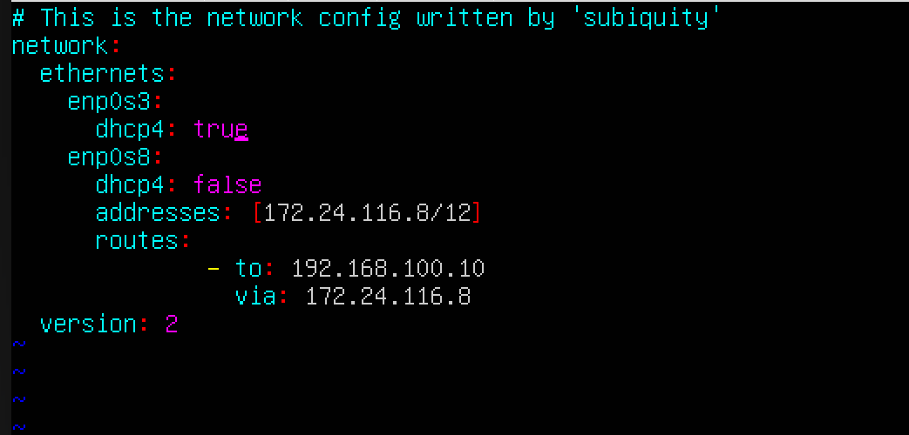

## Part 1. Инструмент ipcalc

### Адрес сети 192.167.38.54/13

<b>Адрес сети - 192.160.0.0</b>

### Перевод масок

<b>Префиксная запись - /24, двоичная - 11111111.11111111.11111111.00000000</b>

<b>Обычная запись - 255.254.0.0, двоичная - 11111111.11111110.00000000.00000000</b>

<b>Обычная запись - 255.255.255.240, префиксная - /28</b>

### Минимальный / максимальный хост в сети 12.167.38.4
- с маской /8

<b>HostMin - 12.0.0.1, HostMax - 12.255.255.254</b>

- с маской 11111111.11111111.00000000.00000000

<b>HostMin - 12.167.0.1, HostMax - 12.167.255.254</b>

- с маской 255.255.254.0

<b>HostMin - 12.167.38.1, HostMax - 12.167.39.254</b>

- с маской /4

<b>HostMin - 0.0.0.1, HostMax - 15.255.255.254</b>

### Localhost
Диапазон localhost: 127.0.0.1 — 127.255.255.254

- 194.34.23.100 - не localhost
- 127.0.0.2 - localhost
- 127.1.0.1 - localhost
- 128.0.0.1 - не localhost

### Диапазоны и сегменты сетей

Диапазоны выделенные локальным сетям:
- 10.0.0.0 — 10.255.255.255
- 100.64.0.0 — 100.127.255.255
- 172.16.0.0 — 172.31.255.255
- 192.168.0.0 — 192.168.255.255

- 10.0.0.45 - частный
- 134.43.0.2 - публичный
- 192.168.4.2 - частный 
- 172.20.250.4 - частный
- 172.0.2.1 - публичный
- 192.172.0.1 - публичный
- 172.68.0.2 - публичный
- 172.16.255.255 - частный
- 10.10.10.10 - частный
- 192.169.168.1 - публичный

IP адреса шлюза у сети 10.10.0.0/18:

<b>10.10.0.0/18</b>

- 10.0.0.1 - неверный
- 10.10.0.2 - верный
- 10.10.10.10 - верный
- 10.10.100.1 - неверный
- 10.10.1.255 - верный

## Part 2. Статическая маршрутизация между двумя машинами

<b>Вывод команды ip a, одинаковый на обеих машинах</b>

Задать следующие адреса и маски: 
- ws1 - 192.168.100.10/16
- ws2 - 172.24.116.8/12

<b>Задать статический IP адрес на машине 1</b>

<b>Задать статический IP адрес на машине 2</b>

### Добавление статического маршрута вручную

<b>Задать статический IP адрес на машине 1</b>

<b>Задать статический IP адрес на машине 2</b>

### Добавление статического маршрута с сохранением

<b>Добавить статический маршрут от одной машины до другой с помощью файла etc/netplan/00-installer-config.yaml</b>

<b>Добавить статический маршрут от одной машины до другой с помощью файла etc/netplan/00-installer-config.yaml</b>

<b>Пинг машины 1</b>

<b>Пинг машины 2</b>

## Part 3. Утилита iperf3

